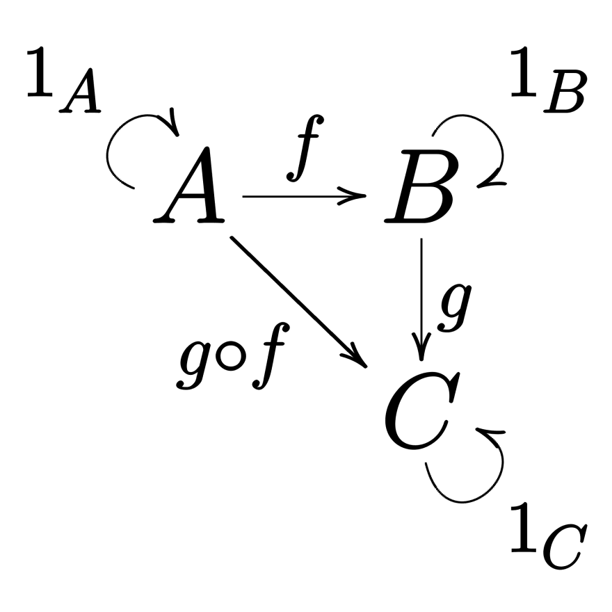

# Getting started with fp-ts

这是通过学习函数式编程工具包 `fp-ts` 来理解学习如何使用函数式编程的方法进行编程.

`fp-ts` 是一位生活在米兰的意大利数学家编写的, 他的名字叫 Giulio Canti (朱利奥·坎蒂)

主要是通过 [dev.to](https://dev.to/gcanti) 网站上的一系列文章来学习, 这个系列的文章是 `fp-ts` 的作者写的.

## 必须知道的概念

### pure program

在 [Canti](https://dev.to/gcanti/getting-started-with-fp-ts-functor-36ek) 的系列文章中, 他是这么描述 **pure program** 的

> We call **pure program** a function with the following signature
>
> ```typescript
> (a: A) => B
> ```
>
> Such a signature models a program which accepts an input of type `A` and yields a result of type `B`, without any effect

### effectful program

> [What exactly does "effectful" mean](https://stackoverflow.com/questions/33386622/what-exactly-does-effectful-mean) 这篇在 *stack overflow* 上的问答比较好的解释了在函数式编程中到底什么是 **effect** 或者说 **effectful**.

A [side effect](https://en.wikipedia.org/wiki/Side_effect_(computer_science)) is an observable interaction with its environment (apart from computing its result value).

> *side effect 是与环境的可观察的相互作用 (除了计算结果值)*
>
> side effect 除了通过输入值计算出输出值外, 还有可以观察到的相互作用发生 (比如: 所有的 IO 操作).根据 Wikipedia 的解释, 如下这些动作均可视为 side effect
>
> - modifying a non-local variable
> - modifying a static local variable
> - modifying a mutable argument passed by reference
> - performing I/O
> - calling other side-effect function

我们可以通过对 **type class** 区分其所谓的 "实际值" 和 "其他值" 来理解 **effect** 概念.

具体上了来说, 如果我们有一个 kind `* -> *` 的 type `f`, 那么在 `f a` 中的 `a` 就是 "实际值", 其余所有剩下的就是 "其他值".

实际上, 上面的解释并不是对 **effect** 严格的定义, 而仅是口头上的定义. 在某些情况下也可能没有所谓的 "实际值" (比如: `Maybe`), 或者有多个 "实际值" (比如: `[]`).

`Functor` 提供修改 "实际值" 的功能, `Applicative` 提供 combine effects, `Monad` 提供依赖之前的 "实际值" 来产生 effect.

在 [Canti](https://dev.to/gcanti/getting-started-with-fp-ts-functor-36ek) 的系列文章中, 他是这么描述 **effectful** 的

> We call **effectful program** a function with the following signature
>
> ```typescript
> (a: A) => F<B>
> ```
>
> Such a signature models a program which accepts an input of type `A` and yields a result of type `B`, along with an **effect** `F`, where `F` is some type constructor.

一个程序接受一个类型是 `A` 的输入, 产生一个类型是 `B` 的输出, 以及一个 effect `F`, 其中 `F` 是某种类型的构造器.

举例如下: 给定一个具体类型 `string`, `Array` 作为类型构造器, 返回 `Array<string>`.

## Monoid

## Categories

### Definition

A category is a pair (Objects, Morphisms) where:

- `Objects` is a collection of **objects**
- `Morphisms` is a collection of **morphisms** (or arrows) between the objects

### Composition

There's an operation `∘`, named "composition", such that the following properties must hold

- (**composition of morphisms**): 如果有 `f: A ⟼ B` 和 `g: B ⟼ C`, 则一定存在 `h = g ∘ f` 即 `h: A ⟼ C`
- associativity: 如果 `f: A ⟼ B`, `g: B ⟼ C` 和 `h: C ⟼ D`, 则 `h ∘ (g ∘ f) = (h ∘ g) ∘ f`
- identity: 对于每个对象 `X`, 一定存在一个态射 `identity: X ⟼ X`, 同时对于 `f: A ⟼ X` 和 `g: X ⟼ B`, 都存在 `identity ∘ f = f` 和 `g ∘ identity = g`



## Functor

函数式编程的核心是 composition, 更加准确说法是 function composition, 现在有个问题是

> How can we compose two generic functions:
>
> - `f: (a: A) => B`
> - `g: (c: C) => D`

## Applicative

## Monad
